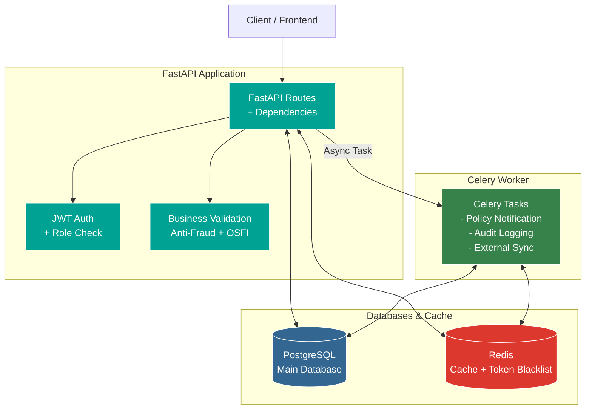
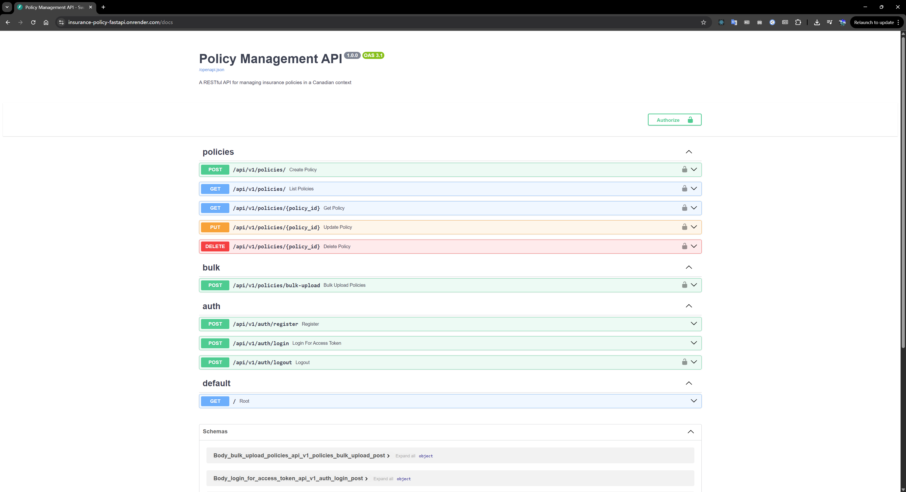
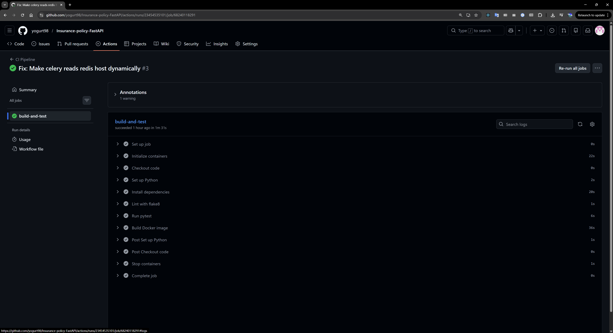
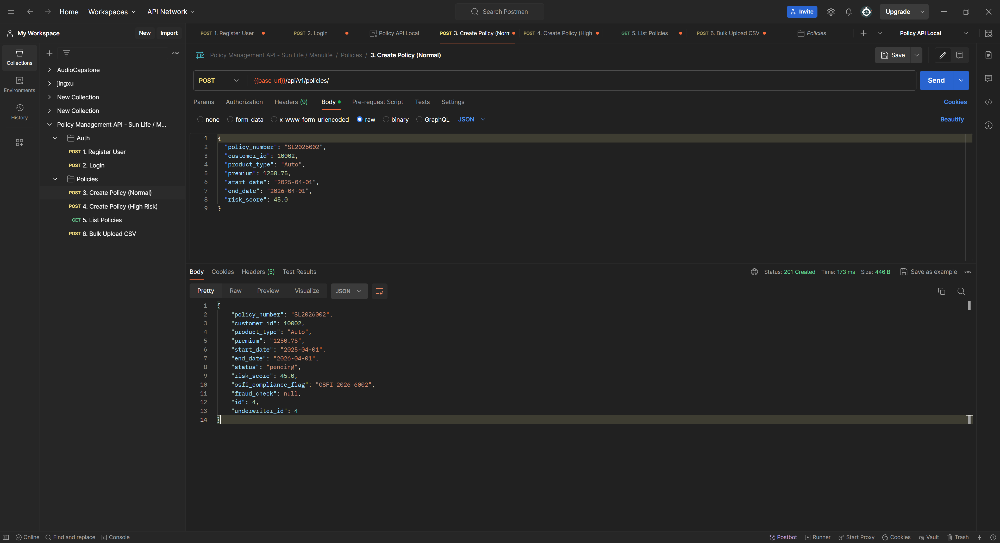

# 🛡️ Insurance Policy Management API


**A production-grade insurance policy management system** designed specifically for Canadian insurers such as Sun Life, Manulife, and Definity.

## Project Highlights

- **High-Performance Async Backend**: Powered by FastAPI, Uvicorn, and async SQLAlchemy 2.0.
- **Enterprise Security**: JWT Authentication with Role-Based Access Control (Admin vs. Underwriter).
- **High-Volume Processing**: Bulk import functionality supporting 100,000+ records via CSV/JSON using Pandas and background tasks.
- **Business Logic Integration**: Built-in anti-fraud engine and automatic OSFI compliance flag generation.
- **Production-Ready Observability**: Structured logging with Correlation IDs, RFC 7807 problem details, and request rate-limiting.
- **Fully Containerized**: Docker & Docker Compose setup for one-click local deployment.
---
## System Architecture

---

## Tech Stack
- **Framework**: FastAPI, Uvicorn
- **Database**: PostgreSQL (async via SQLAlchemy 2.0 + Alembic)
- **Auth**: JWT (PyJWT + bcrypt)
- **Validation**: Pydantic v2
- **Data Processing**: Pandas (bulk import)
- **Caching**: Redis + fastapi-cache
- **Async Tasks**: Celery + Redis (event-driven notifications)
- **Testing**: pytest
- **Deployment**: Docker, Render (demo)

---

## Live Demo (Render)
A live demo is deployed on Render (free tier):
🔗 https://insurance-policy-fastapi.onrender.com/docs

- Swagger UI: https://insurance-policy-fastapi.onrender.com/docs
- Note: Render free tier may sleep after inactivity (first request ~30s delay)

(If the demo link is down, feel free to deploy your own fork using the Render button below or follow the guide in the Deployment section.)
> **Note**: This is hosted on a free Render instance. It spins down after 15 minutes of inactivity. **The first request may take 30–60 seconds to wake up the server.**



---

## Quick Start

```bash
# 1. Clone the repository
git clone https://github.com/yogurt98/Insurance-policy-FastAPI.git
cd project-FastAPI

# 2. Environment Setup
# Copy the example environment file and configure your credentials:
cp .env.example .env
# Important: Update SECRET_KEY and POSTGRES passwords if needed


# 3. Start the services with Docker
docker-compose up --build -d

# 3. Open Swagger documentation
http://localhost:8000/docs
```

---
## Main API Features
###  Authentication
- POST /api/v1/auth/register — Register a new user (Roles: Admin/Underwriter).

- POST /api/v1/auth/login — Authenticate and obtain a JWT access token.

- POST /api/v1/auth/logout — Secure logout (Adds token to a Redis-backed blacklist).

###  Policy Management
- POST /api/v1/policies/ — Create a policy (Triggers anti-fraud & OSFI checks).

- GET /api/v1/policies/ — Retrieve paginated policies (Results cached in Redis).

- GET /api/v1/policies/{id} — Get single policy details.

- PUT /api/v1/policies/{id} — Update an existing policy.

- DELETE /api/v1/policies/{id} — Delete a policy (Restricted to Admin role).

###  Bulk Operations & Business Logic
- POST /api/v1/policies/bulk-upload — Upload CSV/JSON. Tasks are delegated to Celery for background processing, ensuring the API remains responsive.

- Anti-Fraud Engine: Automatically flags policies for review based on risk_score and premium thresholds.

- Regulatory Compliance: Auto-generates unique OSFI-YYYY-XXXXXX identifiers for tracking.

- Financial Accuracy: Utilizes Numeric(precision=2) for all premium calculations to prevent floating-point errors.

- Celery Task Execution Screenshot Placeholder

### Insurance Business Features

- Anti-fraud rule engine: automatic flagging (flag / review) based on risk score and abnormal premium
- OSFI compliance: auto-generation of OSFI-YYYY-XXXXXX identifier
- Precise premium handling: stored as Numeric(precision=2)
- Role-based access: Underwriter can create/view, Admin can delete
---
##  Testing & CI/CD
The project includes a comprehensive suite of unit and integration tests covering CRUD operations, bulk uploads, anti-fraud validation, and JWT blacklisting.

### Run tests locally inside the Docker container:

```docker-compose exec api pytest app/tests/ -v```

### Continuous Integration:
A GitHub Actions workflow is triggered on every push and pull request to the **main** branch. It provisions a PostgreSQL & Redis service, lints the code with **flake8**, and executes the **pytest** suite to ensure no regressions.



---


## Postman Collection
- A complete Postman collection is provided in the project root: postman_collection.json.
- Import it directly into Postman to test all endpoints.

---
## Deployment Guide (Render Free Tier)
1. Fork this repo to your GitHub 
2. Go to https://render.com → New → Web Service 
3. Connect your forked GitHub repo 
4. Choose Docker runtime 
5. Set environment variables (from .env.example)
- DATABASE_URL: Use Render's PostgreSQL addon (free tier available). Use **postgresql+asyncpg://** not **postgres://**
- SECRET_KEY: Generate a strong key

6. Deploy → Wait 5–10 minutes
7. Access Swagger at https://your-app.onrender.com/docs

- Note: Free tier sleeps after 15 minutes inactivity (first request slow).


## License
- MIT License